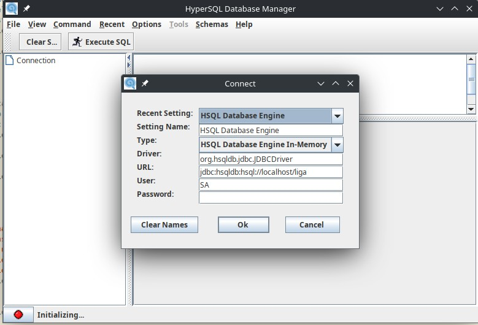

# HSQL-DB Example
This repo contains a database example, that uses HSQL-DB. So it can be used without installing anything on your computer.

## How to run
Database server can be run using the following command:

    java -cp hsqldb-2.7.2.jar org.hsqldb.server.Server --database.0 file:liga --dbname.0 liga

Note that you need this binary open. If you Ctrl-C out of it, server is stopped.

Same jar can be run again on another shell to launch client. Command is pretty straight forward:

    java -jar hsqldb-2.7.2.jar 

With that client running, you can add data from folder [data](./data). To connect to server started with the last command see this image for an example:

Connection string: `jdbc:hsqldb:hsql://localhost/liga`